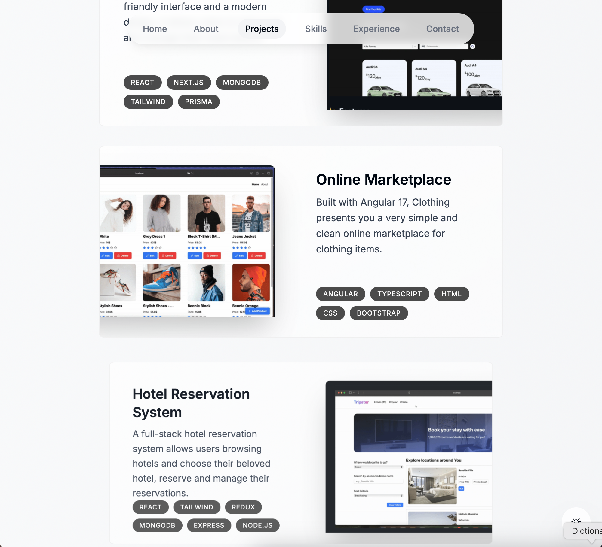

# 🚀 Portfolio

## 📝 About Me

Hi there! I'm a passionate developer focused on creating innovative solutions. This repository showcases my projects and skills.

## 🎥 Demo
🔗 [Live Demo](https://portfolio-nu-neon-93.vercel.app)

## 📸 Screenshots




## 🛠️ Tech Stack

- 💻 Frontend: React, Next.js, TypeScript
- 🎨 Styling: Tailwind CSS, CSS Modules
- 🔧 Tools: Git, VS Code, npm
- 🚀 Deployment: Vercel, Netlify

## 📦 Features

- ✨ Modern UI/UX Design
- 📱 Responsive Layout
- ⚡ Fast Performance
- 🔍 SEO Optimized
- 🌙 Dark Mode Support

## 🏗️ Project Structure

```
portfolio/
├── src/
│   ├── components/
│   ├── pages/
│   └── styles/
├── public/
└── package.json
```

## 🚀 Getting Started

### Prerequisites

- Node.js (v14 or higher)
- npm or yarn
